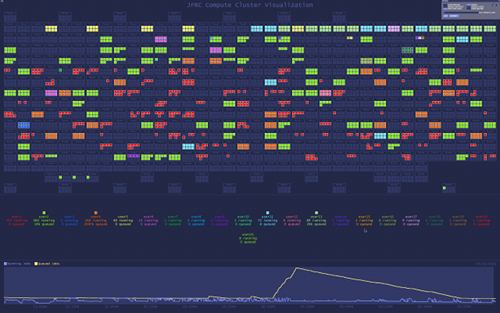

# [Derecho](http://github.com/krokicki/derecho) 

Derecho is a real-time, animated visualization of compute cluster activity, currently supporting Oracle Grid Engine clusters. Its primary goal is to demystify grid architecture and enable intuitive identification of grid usage patterns. It was created by Konrad Rokicki for the compute grid at HHMI's [Janelia Farm Research Campus](http://www.janelia.org/).

## Features

* [Jobs color-coded by user](images/screenshots/derecho_0.png)
* [Browse historical data, or view "live" status](images/screenshots/derecho_1.png)
* [Animated job scheduling](images/screenshots/derecho_2.png)
* [Graph showing number of jobs over time](images/screenshots/derecho_3.png)
* [Single user black-out mode](images/screenshots/derecho_4.png)
* [Node usage heatmap](images/screenshots/derecho_5.png)

## How To Use It

This visualization client is currently set up to work within the confines of certain conventions in use at the JFRC. My goal is to make this tool as configurable as possible, but at this point if you would like to use it on your own grid, some code changes are probably inevitable. Please consider contributing your code back to the project!

## Getting Started

1. Create a MySQL database with the schema in the sql directory, and create a recurring job to populate it with the results of qstat or similar job status tool.
2. Copy ./src/derecho.properties to ./app.properties and customize it to point to the configured MySQL database.
3. Run ant with the default build target to generate a distribution directory under ./build/Derecho
4. (optional) use Jar Bundler to create a app bundle for distribution to OS X systems

## Copyright and License

Copyright 2013 Konrad Rokicki

Licensed under GPL Version 3 (the "License");
you may not use this work except in compliance with the License.
You may obtain a copy of the License in the LICENSE file, or at:

  [http://www.gnu.org/licenses/gpl.html](http://www.gnu.org/licenses/gpl.html)

This program is free software: you can redistribute it and/or modify
it under the terms of the GNU General Public License as published by
the Free Software Foundation, either version 3 of the License, or
(at your option) any later version.

This program is distributed in the hope that it will be useful,
but WITHOUT ANY WARRANTY; without even the implied warranty of
MERCHANTABILITY or FITNESS FOR A PARTICULAR PURPOSE. See the
GNU General Public License for more details.

